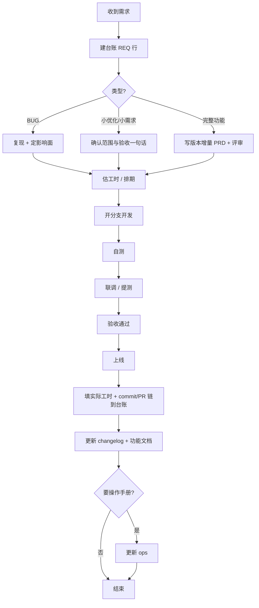

# 需求到上线 — 文档驱动工作流（通用）

> 适用角色：开发兼任维护（无专职 PM）  
> 路径与仓库：**不写死**；以项目 `.cursor/rules/req-workflow.local.mdc` 为准（由 `cursor-std configure-req` 生成）  
> 细则 skill：`req-register`（登记）/ `implement-req`（实现）/ `add-e2e-test`（主路径定稿后 E2E）/ `sync-req-docs`（归档）

本文描述从「收到需求」到「上线留痕」的完整流程。按需求类型分流，但**共用同一套台账与文档更新规则**。

**使用前**：若缺少 `req-workflow.local.mdc`，先运行 `cursor-std configure-req`，禁止猜测文档根或代码仓路径。

---

## 0. 文档角色（先分清写什么）

相对**文档根**（见本地配置）的约定路径：

| 文档 | 作用 | 何时动 |
|------|------|--------|
| `backlog/REQ-index.md` | 需求留痕 + 工时统计入口 | **每条需求当天建一行** |
| `backlog/_template.md` 复制出的 `REQ-*.md` | 单条需求详情（可选，大需求必建） | 评审后完整功能 / 跨仓复杂改动 |
| 功能真相文档（配置中的 feature-doc） | **功能真相**（系统当前长什么样） | 行为变更上线后更新对应章节 |
| changelog（配置中的 changelog） | 按时间的变更摘要 | 每次上线追加一条 |
| `版本功能需求文档.md` / `版本测试文档.md` | 某次大迭代的增量说明与验收 | 仅完整迭代使用 |
| 主流程测试文档（若项目有） | 主流程回归 | 主路径行为变了再改 |
| `ops/` | 操作手册（面向业务） | 大功能或培训前补截图步骤 |

**原则**：台账管「做过什么、花了多久」；功能文档管「现在怎么用」；Git commit 用 `REQ-ID` 把两边串起来。

---

## 1. 需求分类与分流

收到任何口头/微信/邮件需求后，先归类：

| 类型 | 代号前缀建议 | 典型例子 | 要不要单独写版本 PRD |
|------|--------------|----------|----------------------|
| 临时小优化 | `OPT` | 文案改、列字段、筛选项 | 否 |
| 临时小需求 | `FEAT`（小） | 弹窗加一个字段、列表加导出 | 否（台账 + 功能文档补一句即可） |
| 测试/线上 Bug | `BUG` | 分页错、绑定失败 | 否 |
| 评审后完整功能 | `FEAT`（大） | 整模块、大看板 | **是**（版本功能/测试文档） |

编号统一格式：`REQ-YYYYMMDD-序号`，例如 `REQ-20260716-01`。  
类型写在台账「类型」列，不要拆成多套编号体系。  
「端」列使用本地配置中的 **repo label**（如 `app` / `boss` / `api`），多仓写多个 label 或「多端」。

---

## 2. 通用主流程（所有类型都走）



### Step 1 — 收到需求（当天，5～15 分钟）

1. 把甲方原话记进台账「描述」列（可附聊天截图路径/日期）。
2. 用自己的话写「确认理解」：改哪些仓、改哪个页面/接口、做成什么样算完。
3. 填：来源、类型、端（repo label）、状态=`待评估`。
4. **当天必须有 REQ 行**——口头需求不入库 = 无工时、无留痕。

小需求到此即可；完整功能继续 Step 2b。

### Step 2a — 小优化 / 小需求 / Bug（轻量评估）

1. 在代码里定位入口（菜单、页面、接口）。
2. 写清：
   - 影响范围（只前端 / 要后端 / 多仓）
   - 风险（是否动主流程支付、绑定、结算等关键路径）
   - 验收标准（1～3 条可勾选句子）
3. 预估工时（建议 0.5h 粒度），状态 → `待开发` 或 `开发中`。

Bug 额外动作：写清复现步骤、环境（测试/线上）、是否有临时规避。

### Step 2b — 评审后完整功能（重量评估）

1. 复制 `backlog/_template.md` → `backlog/REQ-YYYYMMDD-xx.md`。
2. 新建或追加「版本功能需求文档」（结构：目标、F1…Fn、验收）。
3. 与甲方/相关方评审，改状态为 `已评审`，冻结范围后再开发。
4. 同步准备「版本测试文档」用例骨架（可开发中补全）。

### Step 3 — 开发

1. 从对应仓库合适基线拉分支，建议：`feat/REQ-20260716-01-short-name` 或 `fix/REQ-...`。
2. 实现时保持改动范围 = 台账描述范围；范围外发现的问题**另开 REQ**，勿塞进同一单。
3. Commit 规范（Conventional Commits）：

```text
feat(scope): 一句话说明

REQ-20260716-01
```

Bug：

```text
fix(scope): 一句话说明

REQ-20260716-02
```

4. 多仓改动：各仓库的 commit **都带同一 REQ-ID**，台账「关联 commit」列按 label 分别填写。

### Step 4 — 自测 → 联调 → 提测

| 阶段 | 谁做 | 做什么 |
|------|------|--------|
| 自测 | 你 | 按台账/版本文档**验收标准**逐条勾；主流程相关再跑项目主流程测试文档相关条 |
| 自动化 E2E（可选） | 你 / Agent | **主路径定稿后**（步骤 ②′）：按 stage 打 `data-testid`、写页面 E2E；小程序仅占位。见 `add-e2e-test`。≠ 单测，≠ 人工详测文档 |
| 联调 | 你 + 后端（如有） | 约定环境、账号、脏数据清理；接口契约变更写进 REQ 详情 |
| 提测/验收 | 你代测或甲方点验 | 小改动：发验收说明（截图 + 步骤）；大功能：按版本测试文档执行 |
| 详细测试用例（可选） | 你 / Agent | **代码确认并归档（阶段 B）之后**，若要认真详测或给他人测，再生成步骤级用例（见 §7 步骤 ⑤）；不等于单元测试 / E2E |

**验收标准 vs 详细测试用例 vs E2E**：验收标准是 REQ 里「做成什么样算完」的短清单；详细测试用例是可选的人工步骤 + 预期；E2E 是代码仓内可执行用例，与流程地图 stage 对齐。小需求默认只靠验收标准即可。

状态流转建议：`开发中` → `联调中` → `待验收` → `已上线`（或 `不做` / `挂起`）。

### Step 5 — 上线

按端执行既有发布方式。上线后立即：

1. 台账：实际工时、上线日期、关联 commit/PR、文档是否已更新。
2. changelog 追加一条（日期、REQ、端、一句话）。
3. 更新功能真相文档对应章节（行为变了才改；纯文案/样式可视情况只写 changelog）。
4. 大迭代：把版本 PRD 状态改为「已上线」，并在全量功能文档修订记录里记一笔。
5. 需要给业务培训时，再补 `ops/`。

---

## 3. 四类需求的差异化要点

### 3.1 临时小优化

- **尽量当天进台账、当天或当周合入**。
- 可不建独立 `REQ-*.md`，台账一行 + commit footer 足够。
- 功能文档：若用户可见行为变了，改对应小节一句；否则只记 changelog。

### 3.2 临时小需求

- 与优化相同流程，但验收句写清楚「有/无某能力」。
- 若牵涉权限、结算、绑定等核心关系：升级为「完整功能」流程（先评审再写）。

### 3.3 测试 / 线上 Bug

- 优先复现与定级：阻断主流程 → 插队；轻微 UI → 排期。
- 台账类型=`BUG`，描述里区分「测试环境」与「生产」。
- 修复后 changelog 用 `fix:` 语义；功能文档仅当「原先文档写错」或「行为定义变化」时改。
- 线上紧急：可先修后补台账，但**同一天必须补 REQ 行与工时**。

### 3.4 评审后完整功能

- 必须有：版本增量 PRD + 测试用例 +（建议）独立 REQ 详情文件。
- 开发中范围变更：改版本 PRD 修订记录，并在台账备注「范围变更」，必要时拆新 REQ。
- 上线后：版本文档归档（保留不删），全量功能文档吸收进「当前真相」。

---

## 4. Git 与文档如何关联（检查清单）

上线前自问：

- [ ] 台账有本 REQ，状态将变为 `已上线`
- [ ] 相关 commit message 含 `REQ-YYYYMMDD-xx`
- [ ] 台账「关联 commit」已粘贴 short hash 或 PR 链接（多仓按 label 各写）
- [ ] changelog 已追加
- [ ] 行为变更已同步进全量功能文档（或已确认无需改）
- [ ] 实际工时已填

检索示例（在对应代码仓中）：

```bash
git log --grep=REQ-20260716-01
```

---

## 5. 工时怎么记（便于后期统计）

1. **预估**：开工前写在台账（含联调缓冲，勿只估纯写码）。
2. **实际**：上线当天或次日填写；含自测、联调、改 bug、沟通。
3. **拆单**：同一周多个小优化 → 多行 REQ，不要合成「杂项一天」。
4. **月末**：按 `REQ-index.md` 筛选月份 / 类型透视即可。

建议计时粒度：**0.5 小时**。沟通开会也计入该 REQ。

---

## 6. 本地试运行最小闭环（第一次就按这个练）

1. 下一条甲方消息 → 在 `REQ-index.md` 加一行。
2. 开发时 commit 带上该 REQ-ID。
3. 上线后改：台账状态/工时/commit、changelog、必要时全量功能文档一句。
4. 跑通一次后，再决定是否把台账迁到飞书等外部系统。

---

## 7. 与 Cursor 协作（推荐实际用法）

日常和 Cursor 对话时，可按下面推进——与上文 Step 1～5 **同一条主流程**，只是把「写台账 / 写码 /（可选）E2E / 归档 /（可选）人工测试用例」交给 Agent。

| 你的实际步骤 | 对应本文 | Skill / 约定 |
|--------------|----------|--------------|
| ① 描述需求 → 生成 REQ | Step 1 + 2a/2b | 「按工作流登记需求」→ `req-register` |
| ② 按 REQ 生成代码 | Step 3 | 「按 REQ-xxx 实现」→ `implement-req` |
| ②′ 主路径定稿后补 E2E（可选） | Step 4 自动化 | 「REQ-xxx 主路径已定，补 E2E」→ `add-e2e-test` |
| ③ 中途改细节 / 重生成代码 | Step 3 范围变更 | 先改 REQ，再继续实现；勿只改码不改台账 |
| ④ 代码确认后反向总结并归档 | Step 5（文档侧） | 「REQ-xxx 已确认，同步文档」→ `sync-req-docs` |
| ⑤ 归档后生成详细测试用例（可选） | Step 4 详测 | 「REQ-xxx 生成测试用例」；写回该 REQ，无独立 skill |

**对齐说明（读一遍即可）**

- ①→②→④ 与文档一致：**先留痕再写码，确认后再归档**；②′ 在主路径定稿后、④ 之前按需做；⑤ 在 ④ 之后按需做。
- ③ 合法且常见；关键是**范围变了就改 REQ**（台账备注 / 详情文件），否则阶段 B 会对着过时描述归档。
- 「反向总结」= 以**确认后的代码 + git** 为准更新文档；若实现与原 REQ 有偏差，**同时回写 REQ**，不要只改 changelog。
- 阶段 B 时机是「代码你已确认可用」；正式生产发布后把台账状态改为 `已上线` 并补上线日即可。
- **②′ / ⑤ 不要默认全开**：小优化 / 简单 Bug 通常验收标准足够；主路径未定不要铺 E2E。
- **②′ ≠ ⑤**：E2E 是可执行测试；⑤ 是给人看的步骤级用例。
- **验收勾选 ≠ AI 已跑通测试**：验收标准勾选应由你手测后改，或明确授权后再勾。
- **小程序自动化**：中央 skill 只写占位说明，与 H5 共用 stage 名；驱动由项目后续接入。

### 7.1 对话模板（复制改填）

方括号 `[ ]` 换成你的内容。端 / 仓名用本地配置中的 label。

#### A. 生成 / 登记 REQ（对应步骤 ①）

**小优化 / 小需求 / Bug（轻量）**

```text
请按 REQ 工作流登记需求（今天日期）：

- 甲方原话 / 我的描述：[粘贴]
- 初步判断类型：优化 | 小需求 | BUG
- 端：[配置中的 label，如 app / boss / 多端]
- 相关页面或入口：[…]

请：
1. 在 backlog/REQ-index.md 加一行（编号 REQ-YYYYMMDD-xx）
2. 用「确认理解」写清：改什么、做成什么样算完、1～3 条验收句
3. 若值得单独留痕，再从 backlog/_template.md 建 REQ 详情文件
4. 先不要改业务代码
```

**完整功能（重量，需评审）**

```text
这是完整功能，请按 Step 2b 建档，暂不写代码：

- 背景与目标：[…]
- 端：[label…]
- 已知约束：[…]

请建 REQ 台账行 + backlog/REQ-*.md，并起草版本功能需求文档骨架（F1…Fn + 验收）；
状态先「待评估」或「已评审」（按我是否已口头拍板）。
```

#### B. 按 REQ 实现代码（对应步骤 ②）

```text
按 REQ-YYYYMMDD-xx 实现。

约束：
- 只改台账允许的范围；范围外问题另开 REQ
- 本阶段不要更新 changelog / 功能真相文档 / ops
- 用户可见主路径：编排入口补流程地图（stage 1→N）与 `// --- stageName ---`
- 主路径未定不要铺全量 E2E；定稿后可再说「补 E2E」
- 改完用中文简报：端、文件、入口路径、stage 表、调用深度、E2E/单测状态、如何自测验收句；未确认前不要 git commit
```

#### B2. 主路径定稿后补 E2E（对应步骤 ②′ · 可选）

```text
REQ-YYYYMMDD-xx 主路径已定，请补 E2E（add-e2e-test）。

约束：
- 以当前 stage 表与验收句为准；只给本用例控件打 data-testid
- 沿用仓库已有 E2E 栈；没有再生成最小骨架
- 小程序仅写 e2e/miniprogram 占位说明，不生成假可跑用例
- 不改 changelog / 功能真相；未确认前不要 git commit
```

#### C. 中途改需求细节（对应步骤 ③ · 范围变了）

```text
REQ-YYYYMMDD-xx 需求细节变更（先改文档再改代码）：

- 变更点：[…]
- 不变：[其余验收句仍有效 / 或列出作废项]

请：
1. 更新该 REQ 详情与台账备注（标明「范围变更」）
2. 再按更新后的 REQ 改代码
3. 仍不要同步 changelog / 全量功能文档
```

#### D. 中途只修实现、不改范围（对应步骤 ③ · 重生成/修 Bug）

```text
REQ-YYYYMMDD-xx 验收范围不变，请按当前 REQ 修正实现：

- 问题：[…]
- 期望：[…]

不要改需求文档范围；修完对照验收句说明如何自测。
```

#### E. 代码确认后归档文档（对应步骤 ④）

```text
REQ-YYYYMMDD-xx 代码已确认，请同步文档（阶段 B）。

- 关联 commit（若已知）：label `hash` / …（未知则请 git log --grep）
- 实际工时：[如 2.5h]（未知先问我再填）
- 是否已上线：[是，日期 … / 否，状态先待验收]
- 额外：需要 ops 操作手册吗？[是/否]

请按类型裁剪更新：台账、changelog、必要时功能真相文档；
以确认后的代码为准反向核对，若与 REQ 原文有偏差请回写 REQ。
```

#### F. 归档后生成详细测试用例（对应步骤 ⑤ · 可选）

```text
REQ-YYYYMMDD-xx 已归档，请生成详细测试用例（不改业务代码）。

约束：
- 以确认后的代码 + 当前 REQ 为准
- 写在该 REQ 详情新增「测试用例」节（步骤 + 预期）；小需求勿新建整份版本测试文档
- 覆盖验收标准，并补边界
- 验收标准勾选请保留未勾或仅勾我已手测项；不要默认全部勾选
```

#### G. 仅要 commit 文案（可选）

走已安装的通用 **commit-helper** skill（`.cursor/skills/standards/commit-helper/`）：

```text
已 git add。请用 commit-helper 生成 commit 文案；
footer 带 REQ-YYYYMMDD-xx；不要自动 commit。
```

### 7.2 最小口令速查

| 目的 | 你对 Cursor 说 |
|------|----------------|
| 建需求 | 「按工作流登记需求：…」 |
| 写代码 | 「按 REQ-xxx 实现」 |
| 补 E2E（可选） | 「REQ-xxx 主路径已定，补 E2E」 |
| 改范围 | 「REQ-xxx 细节变更，先改 REQ 再改代码：…」 |
| 归档 | 「REQ-xxx 已确认，同步文档」 |
| 测试用例（可选，人工） | 「REQ-xxx 已归档，请生成详细测试用例」 |
| commit 文案 | 「生成 commit 文案」（先 `git add`；走 commit-helper） |

---

## 8. 常见坑

| 坑 | 后果 | 避免 |
|----|------|------|
| 口头接了就改，不建 REQ | 无法统计工时、无法回溯 | 先一行台账再动码 |
| 一个 commit 塞多个无关需求 | 无法关联文档 | 一事一 REQ，一逻辑一 commit |
| 只改代码不改功能文档 | 文档与线上漂移 | 上线检查清单强制勾选 |
| 大需求不评审直接做 | 返工多 | 完整功能必须 Step 2b |
| 把「想法」写成「已承诺」 | 范围失控 | 台账状态区分待评估/已评审 |
| 中途改了交互却不改 REQ | 阶段 B 按过时描述归档 | 步骤 ③ 先改 REQ 再改码 |
| 未确认代码就同步全量文档 | 文档跟着半成品漂 | 只用「已确认，同步文档」触发阶段 B |
| 阶段 B 默认勾满验收 / 当已测完 | 误以为已详测通过 | 验收勾选以手测为准；详测用步骤 ⑤ 另出用例 |
| 每个小需求强制写长测试文档 | 文档负担大、难维护 | ⑤ 可选；默认验收标准足够 |
| 主路径未定就铺全站 E2E / testid | 用例易碎、返工多 | ②′ 仅定稿后；增量打标 |
| 把人工详测当成 E2E，或阶段 B 才写可执行测试 | 文档与代码脱节 | E2E 走 ②′ / `add-e2e-test`；⑤ 只写给人看的步骤 |
| 未配置路径就猜仓库 | 改错仓 / 写错文档 | 先 `configure-req`，缺配置则停止 |
