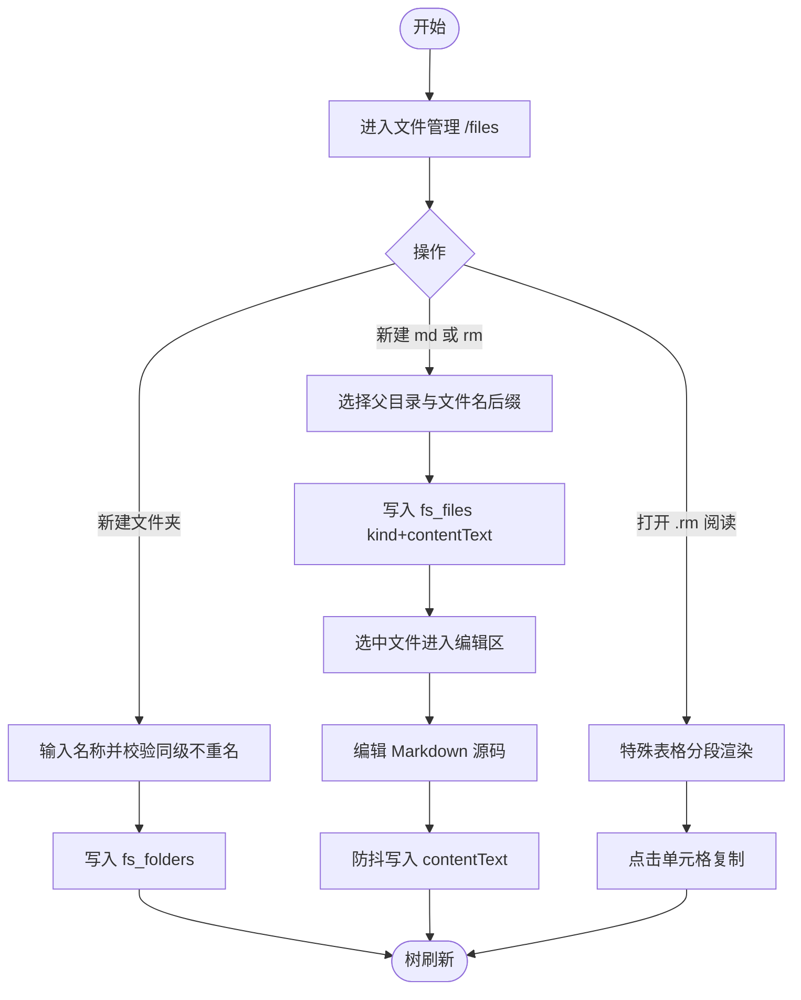
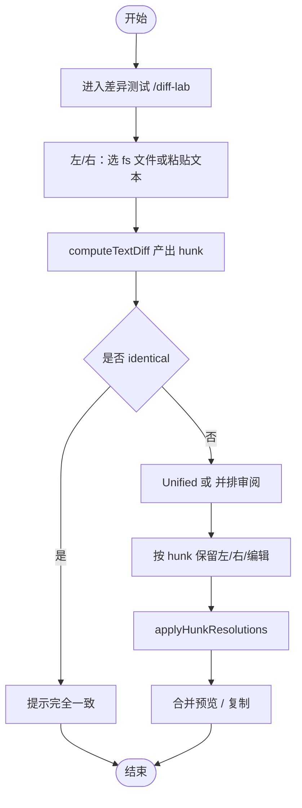
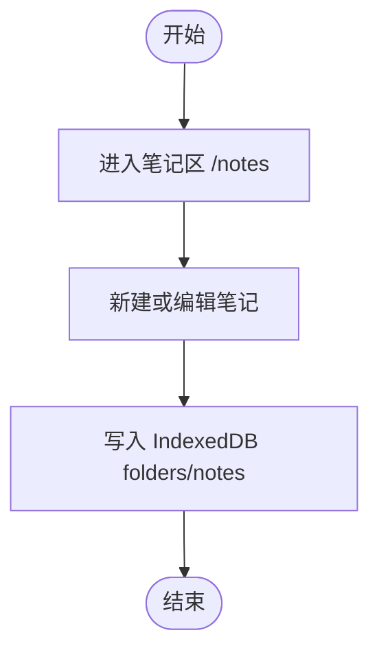
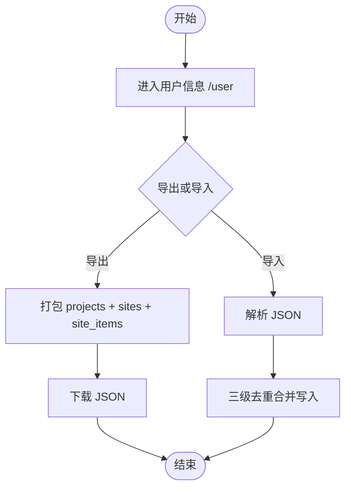
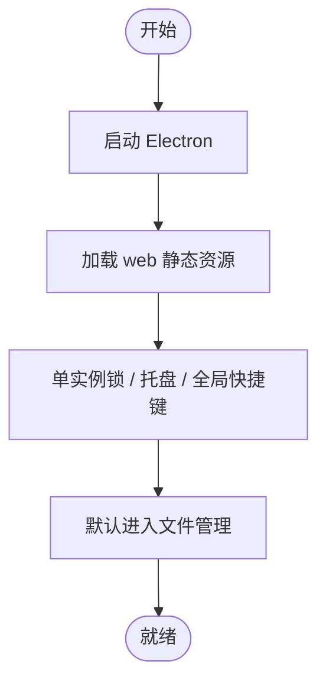

# 用户流程图（Flow Chart）

## 0) 文件管理：建目录 → 建文件 → 编辑保存（主线）

```mermaid
flowchart TD
  A([开始]) --> B[进入文件管理 /files]
  B --> C{操作}
  C -->|新建文件夹| D[输入名称并校验同级不重名]
  D --> E[写入 fs_folders]
  E --> Z([树刷新])
  C -->|新建 md 或 rm| F[选择父目录与文件名后缀]
  F --> G[写入 fs_files kind+contentText]
  G --> H[选中文件进入编辑区]
  H --> I[编辑 Markdown 源码]
  I --> J[防抖写入 contentText]
  J --> Z
  C -->|打开 .rm 阅读| K[特殊表格分段渲染]
  K --> L[点击单元格复制]
  L --> Z
```

## 0b) 差异测试：比对 → 裁决 → 合并预览

```mermaid
flowchart TD
  A([开始]) --> B[进入差异测试 /diff-lab]
  B --> C[左/右：选 fs 文件或粘贴文本]
  C --> D[computeTextDiff 产出 hunk]
  D --> E{是否 identical}
  E -->|是| F[提示完全一致]
  F --> Z([结束])
  E -->|否| G[Unified 或 并排审阅]
  G --> H[按 hunk 保留左/右/编辑]
  H --> I[applyHunkResolutions]
  I --> J[合并预览 / 复制]
  J --> Z
```

## 1) Web 端：笔记区本地编辑（冻结模块，现状）

```mermaid
flowchart TD
  A([开始]) --> B[进入笔记区 /notes]
  B --> C[新建或编辑笔记]
  C --> D[写入 IndexedDB folders/notes]
  D --> Z([结束])
```

## 2) 用户信息：导出 / 导入（项目·站点，不含 fs_*）

```mermaid
flowchart TD
  A([开始]) --> B[进入用户信息 /user]
  B --> C{导出或导入}
  C -->|导出| D[打包 projects + sites + site_items]
  D --> E[下载 JSON]
  E --> Z([结束])
  C -->|导入| F[解析 JSON]
  F --> G[三级去重合并写入]
  G --> Z
```

## 3) 桌面端启动

```mermaid
flowchart TD
  A([开始]) --> B[启动 Electron]
  B --> C[加载 web 静态资源]
  C --> D[单实例锁 / 托盘 / 全局快捷键]
  D --> E[默认进入文件管理]
  E --> Z([就绪])
```
