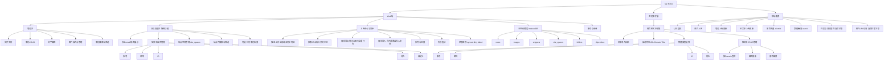

# 产品功能结构图

```mermaid
graph TD
  A[My Notes] --> B[Web端]
  A --> C[浏览器扩展]
  A --> D[后端服务]

  B --> B1[笔记区]
  B --> B2[站点信息区 特殊功能]
  B --> B3[上传中心与同步]
  B --> B4[本地存储层 IndexedDB]
  B --> B5[账号与会话]

  B1 --> B11[文件夹树]
  B1 --> B12[笔记CRUD]
  B1 --> B13[文字编辑]
  B1 --> B14[图片插入与管理]
  B1 --> B15[笔记搜索与筛选]

  B2 --> B21[按Domain隔离展示]
  B2 --> B22[短文本条目管理]
  B22 --> B221[账号]
  B22 --> B222[密码]
  B22 --> B223[ID]
  B22 --> B224[待办]
  B22 --> B225[自定义]
  B2 --> B23[站点空间管理 site_spaces]
  B2 --> B24[站点内搜索与筛选]
  B2 --> B25[可选 转为笔记后置]

  B3 --> B31[推送 上传当前或未同步内容]
  B3 --> B32[拉取 从云端合并到本地]
  B3 --> B33[离线导出 笔记与图片全量打包]
  B3 --> B34[离线导入 合并或覆盖写入本地]
  B3 --> B35[队列与进度]
  B3 --> B36[失败重试]
  B3 --> B37[状态回写 synced dirty failed]

  B4 --> B41[notes]
  B4 --> B42[images]
  B4 --> B43[snippets]
  B4 --> B44[site_spaces]
  B4 --> B45[folders]
  B4 --> B46[clips inbox]

  C --> C1[网页短文本采集]
  C1 --> C11[文本录入粘贴]
  C1 --> C12[自动附带URL Domain Title]
  C1 --> C13[快捷类型选择]
  C13 --> C131[账号]
  C13 --> C132[密码]
  C13 --> C133[ID]
  C13 --> C134[待办]
  C1 --> C14[短文本CRUD管理]
  C14 --> C141[按Domain查询]
  C14 --> C142[编辑更新]
  C14 --> C143[删除条目]

  D --> D1[认证鉴权]
  D --> D2[图片上传]
  D --> D3[笔记上传更新]
  D --> D4[短文本上传更新]
  D --> D5[幂等去重 clientId]
  D --> D6[数据隔离 userId]
  D --> D7[列表与详情查询 支撑拉取]
  D --> D8[图片URL访问 支撑拉取下载]
```

## 说明

- 信息架构采用两个平级一级入口：`笔记区` 与 `站点信息区`。
- `站点信息区` 为特殊功能模块，默认与笔记数据互不干扰。
- 同步策略为**手动推送 + 手动拉取**，并支持**离线导出/导入**；默认本地优先。
- 浏览器扩展仅提供网页短文本数据 CRUD，不展示笔记目录与笔记内容。
