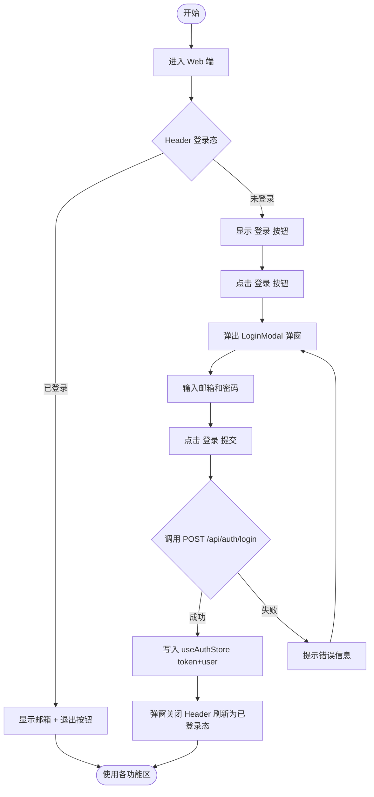
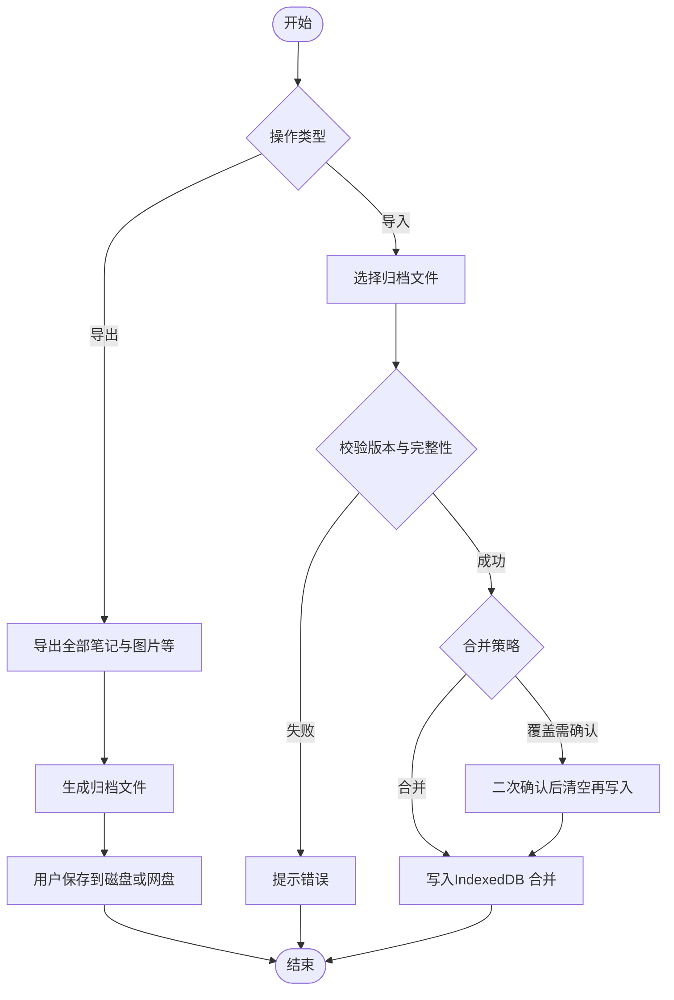
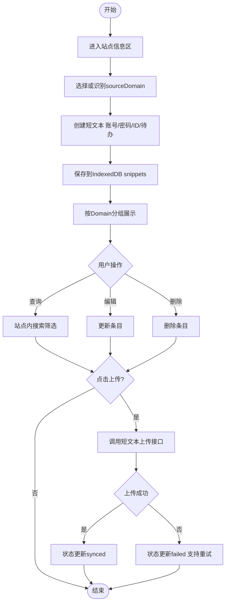
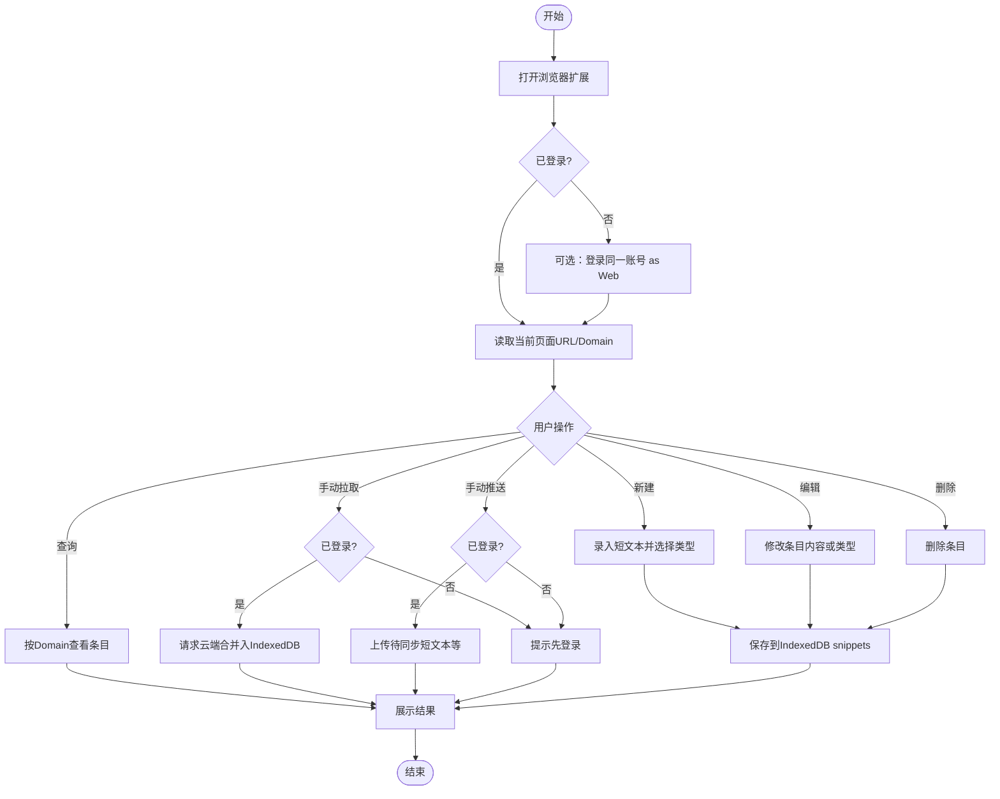
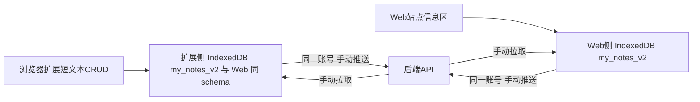

# 用户流程图（Flow Chart）

## 0) Web 端：登录流程

## 1) Web 端：笔记区本地编辑、手动推送与手动拉取

## 1A) Web 端：离线全量导出与导入

## 2) Web 端：站点信息区（特殊功能）流程

## 3) 浏览器扩展：短文本 CRUD + 登录与手动同步

## 4) 端间协同流程（扩展与Web）

- 两端本地库物理隔离，通过**同一 userId 云端**与**相同同步语义**保持一致。

