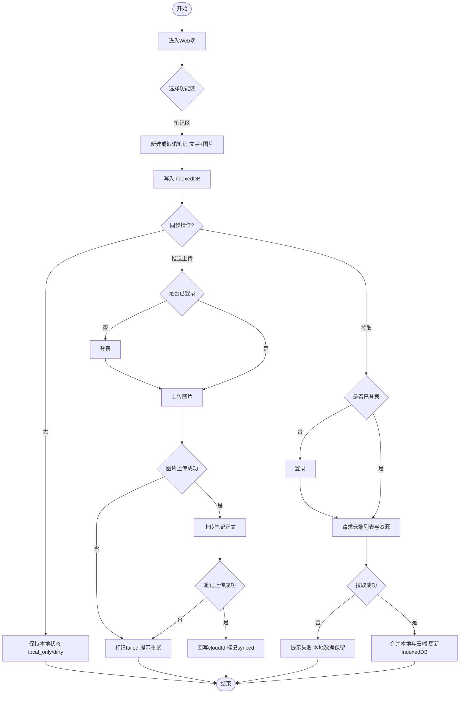
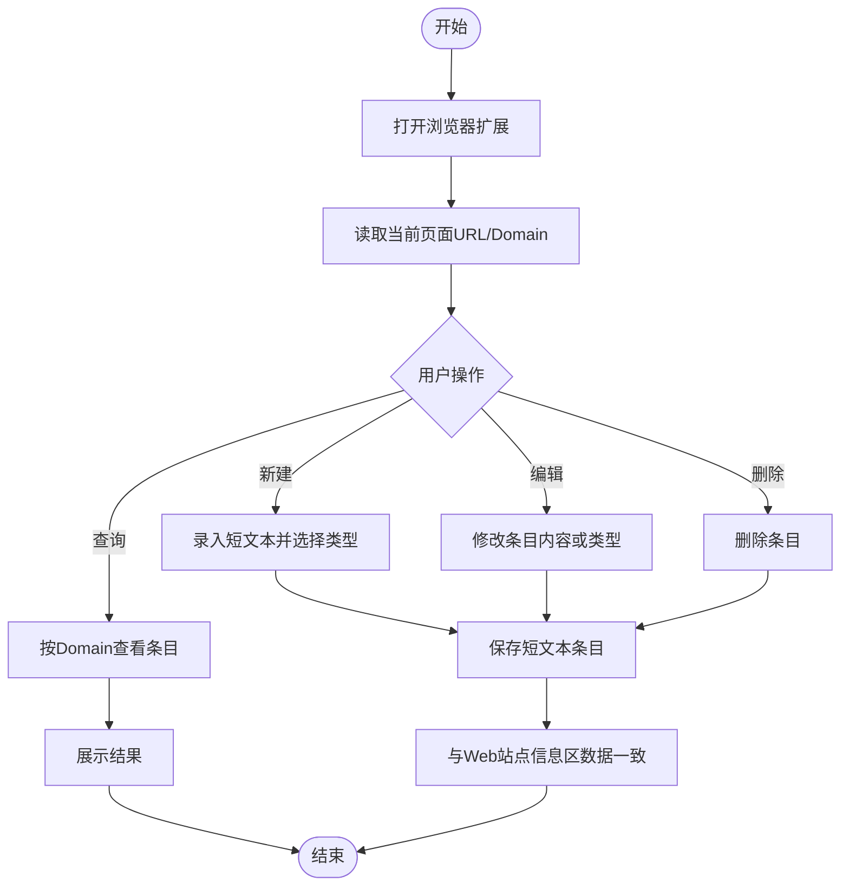
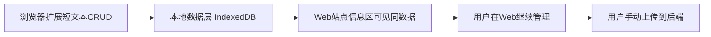

# 用户流程图（Flow Chart）

## 1) Web 端：笔记区本地编辑、手动推送与手动拉取

```mermaid
flowchart TD
  A([开始]) --> B[进入Web端]
  B --> C{选择功能区}
  C -->|笔记区| D[新建或编辑笔记 文字+图片]
  D --> E[写入IndexedDB]
  E --> F{同步操作?}
  F -->|无| G[保持本地状态 local_only/dirty]
  G --> Z([结束])
  F -->|推送上传| H{是否已登录}
  H -->|否| I[登录]
  I --> J[上传图片]
  H -->|是| J
  J --> K{图片上传成功}
  K -->|否| L[标记failed 提示重试]
  L --> Z
  K -->|是| M[上传笔记正文]
  M --> N{笔记上传成功}
  N -->|否| L
  N -->|是| O[回写cloudId 标记synced]
  O --> Z
  F -->|拉取| P{是否已登录}
  P -->|否| Q[登录]
  Q --> R[请求云端列表与资源]
  P -->|是| R
  R --> S{拉取成功}
  S -->|否| T[提示失败 本地数据保留]
  T --> Z
  S -->|是| U[合并本地与云端 更新IndexedDB]
  U --> Z
```

## 1A) Web 端：离线全量导出与导入

```mermaid
flowchart TD
  A([开始]) --> B{操作类型}
  B -->|导出| C[导出全部笔记与图片等]
  C --> D[生成归档文件]
  D --> E[用户保存到磁盘或网盘]
  E --> Z([结束])
  B -->|导入| F[选择归档文件]
  F --> G{校验版本与完整性}
  G -->|失败| H[提示错误]
  H --> Z
  G -->|成功| I{合并策略}
  I -->|合并| J[写入IndexedDB 合并]
  I -->|覆盖需确认| K[二次确认后清空再写入]
  K --> J
  J --> Z
```

## 2) Web 端：站点信息区（特殊功能）流程

```mermaid
flowchart TD
  A([开始]) --> B[进入站点信息区]
  B --> C[选择或识别sourceDomain]
  C --> D[创建短文本 账号/密码/ID/待办]
  D --> E[保存到IndexedDB snippets]
  E --> F[按Domain分组展示]
  F --> G{用户操作}
  G -->|查询| H[站点内搜索筛选]
  G -->|编辑| I[更新条目]
  G -->|删除| J[删除条目]
  H --> K{点击上传?}
  I --> K
  J --> K
  K -->|否| L([结束])
  K -->|是| M[调用短文本上传接口]
  M --> N{上传成功}
  N -->|是| O[状态更新synced]
  N -->|否| P[状态更新failed 支持重试]
  O --> L
  P --> L
```

## 3) 浏览器扩展：仅短文本 CRUD（不含笔记）

```mermaid
flowchart TD
  A([开始]) --> B[打开浏览器扩展]
  B --> C[读取当前页面URL/Domain]
  C --> D{用户操作}
  D -->|新建| E[录入短文本并选择类型]
  D -->|查询| F[按Domain查看条目]
  D -->|编辑| G[修改条目内容或类型]
  D -->|删除| H[删除条目]
  E --> I[保存短文本条目]
  F --> J[展示结果]
  G --> I
  H --> I
  I --> K[与Web站点信息区数据一致]
  J --> L([结束])
  K --> L
```

## 4) 端间协同流程（扩展与Web）

```mermaid
flowchart LR
  A[浏览器扩展短文本CRUD] --> B[本地数据层 IndexedDB]
  B --> C[Web站点信息区可见同数据]
  C --> D[用户在Web继续管理]
  D --> E[用户手动上传到后端]
```

