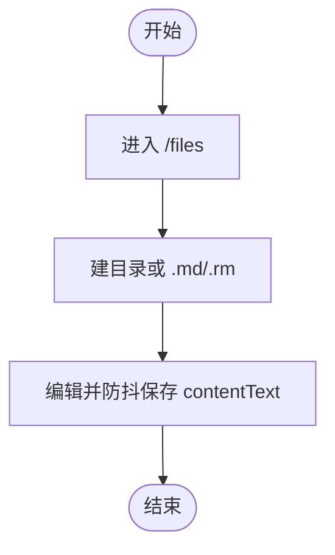
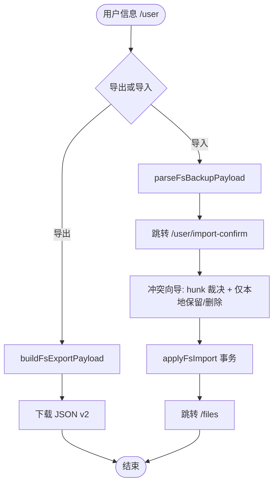
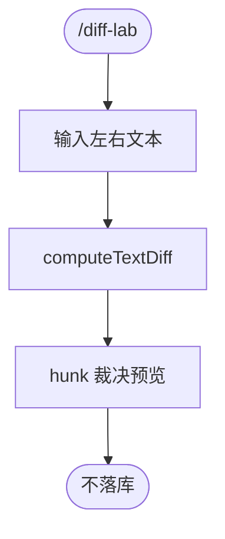
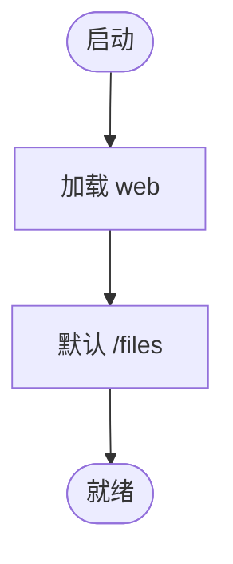

# 用户流程图（Flow Chart）

## 0) 文件管理编辑（主线）

```mermaid
flowchart TD
  A([开始]) --> B[进入 /files]
  B --> C[建目录或 .md/.rm]
  C --> D[编辑并防抖保存 contentText]
  D --> Z([结束])
```

## 1) 导出 / 导入文件管理（含冲突）

```mermaid
flowchart TD
  A([用户信息 /user]) --> B{导出或导入}
  B -->|导出| C[buildFsExportPayload]
  C --> D[下载 JSON v2]
  D --> Z([结束])
  B -->|导入| E[parseFsBackupPayload]
  E --> F[跳转 /user/import-confirm]
  F --> G[冲突向导: hunk 裁决 + 仅本地保留/删除]
  G --> H[applyFsImport 事务]
  H --> I[跳转 /files]
  I --> Z
```

## 2) 差异测试

```mermaid
flowchart TD
  A([/diff-lab]) --> B[输入左右文本]
  B --> C[computeTextDiff]
  C --> D[hunk 裁决预览]
  D --> Z([不落库])
```

## 3) 桌面端启动

```mermaid
flowchart TD
  A([启动]) --> B[加载 web]
  B --> C[默认 /files]
  C --> Z([就绪])
```
