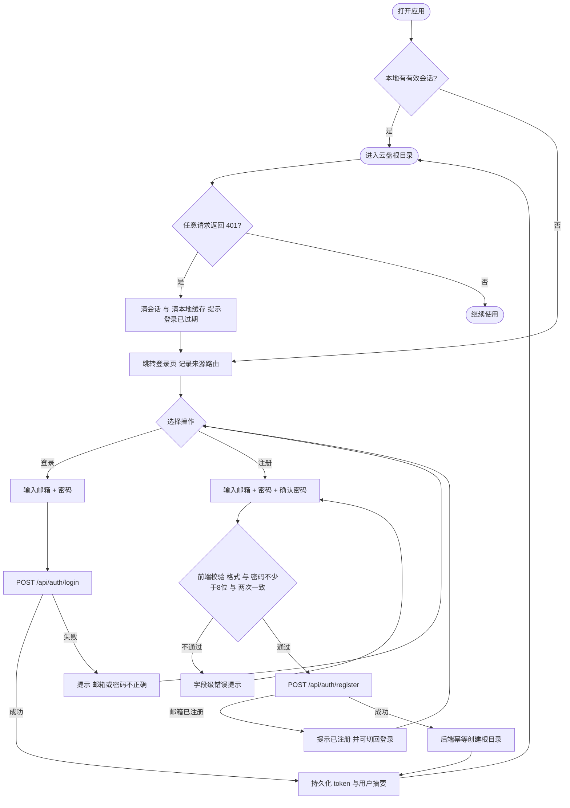
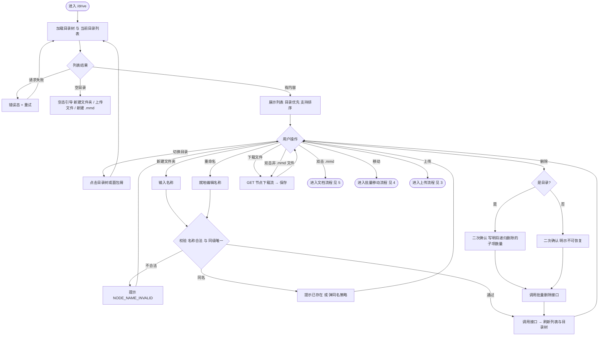
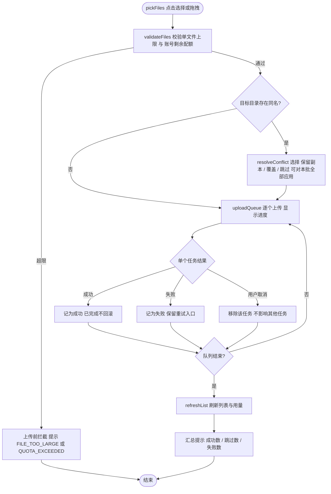
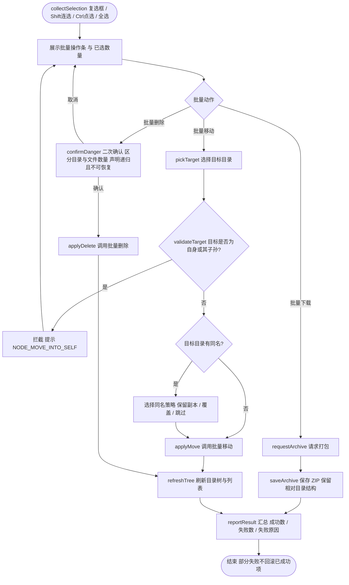
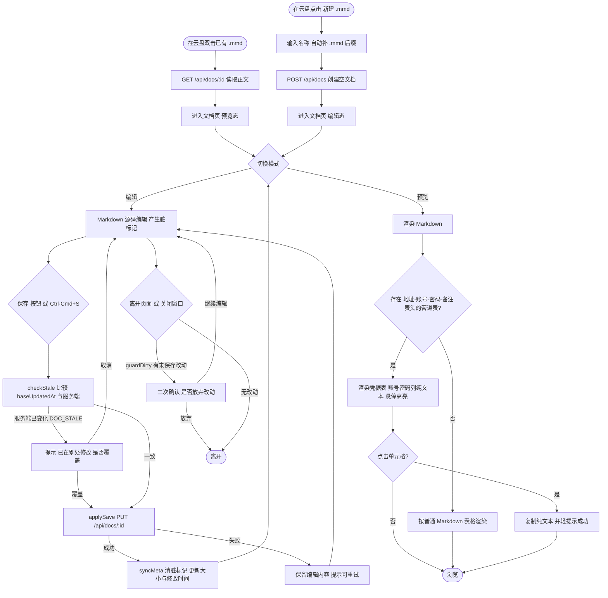
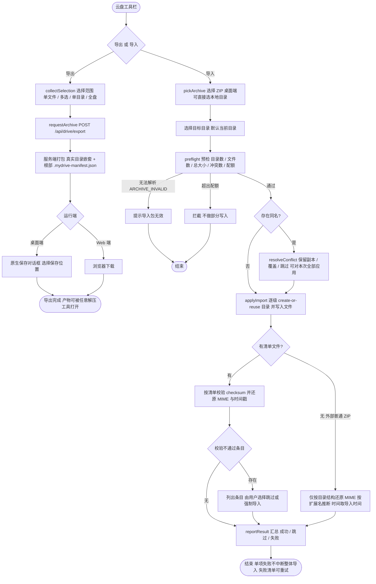
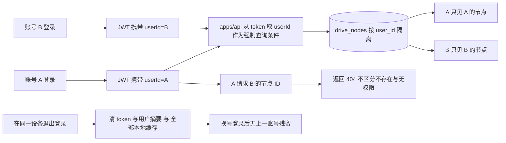

# 用户流程图（Flow Chart）

**基线版本**：`1.0.0`。流程与 [PRD.md](./PRD.md) 一一对应；节点命名与 [开发文档 §5.3](./开发文档.md) 的 stage 名保持一致，便于实现与 E2E 定位对齐。

---

## 1. 注册 / 登录 / 会话

```mermaid
flowchart TD
  A([打开应用]) --> B{本地有有效会话?}
  B -->|是| Z([进入云盘根目录])
  B -->|否| C[跳转登录页 记录来源路由]
  C --> D{选择操作}

  D -->|登录| E[输入邮箱 + 密码]
  E --> F[POST /api/auth/login]
  F -->|成功| G[持久化 token 与用户摘要]
  F -->|失败| H[提示 邮箱或密码不正确]
  H --> D

  D -->|注册| I[输入邮箱 + 密码 + 确认密码]
  I --> J{前端校验 格式 与 密码不少于8位 与 两次一致}
  J -->|不通过| K[字段级错误提示]
  K --> I
  J -->|通过| L[POST /api/auth/register]
  L -->|邮箱已注册| M[提示已注册 并可切回登录]
  M --> D
  L -->|成功| N[后端幂等创建根目录]
  N --> G

  G --> Z
  Z --> O{任意请求返回 401?}
  O -->|是| P[清会话 与 清本地缓存 提示登录已过期]
  P --> C
  O -->|否| Q([继续使用])
```

---

## 2. 云盘浏览与目录 / 文件 CRUD

```mermaid
flowchart TD
  A([进入 /drive]) --> B[加载目录树 与 当前目录列表]
  B --> C{列表结果}
  C -->|请求失败| D[错误态 + 重试]
  D --> B
  C -->|空目录| E[空态引导 新建文件夹 / 上传文件 / 新建 .mmd]
  C -->|有内容| F[展示列表 目录优先 支持排序]

  F --> G{用户操作}
  G -->|切换目录| H[点击目录树或面包屑]
  H --> B
  G -->|新建文件夹| I[输入名称]
  G -->|重命名| J[就地编辑名称]
  I --> K{校验 名称合法 与 同级唯一}
  J --> K
  K -->|不合法| L[提示 NODE_NAME_INVALID]
  L --> G
  K -->|同名| M[提示已存在 或 弹同名策略]
  M --> G
  K -->|通过| N[调用接口 → 刷新列表与目录树]
  N --> G

  G -->|删除| O{是目录?}
  O -->|是| P[二次确认 写明将递归删除的子项数量]
  O -->|否| Q[二次确认 明示不可恢复]
  P --> R[调用批量删除接口]
  Q --> R
  R --> N

  G -->|下载文件| S[GET 节点下载流 → 保存]
  S --> G
  G -->|双击非 .mmd 文件| S
  G -->|双击 .mmd| T([进入文档流程 见 5])
  G -->|移动| U([进入批量移动流程 见 4])
  G -->|上传| V([进入上传流程 见 3])
```

---

## 3. 文件上传（含同名冲突）

```mermaid
flowchart TD
  A([pickFiles 点击选择或拖拽]) --> B[validateFiles 校验单文件上限 与 账号剩余配额]
  B -->|超限| C[上传前拦截 提示 FILE_TOO_LARGE 或 QUOTA_EXCEEDED]
  C --> Z([结束])
  B -->|通过| D{目标目录存在同名?}
  D -->|否| F[uploadQueue 逐个上传 显示进度]
  D -->|是| E[resolveConflict 选择 保留副本 / 覆盖 / 跳过 可对本批全部应用]
  E --> F
  F --> G{单个任务结果}
  G -->|成功| H[记为成功 已完成不回滚]
  G -->|失败| I[记为失败 保留重试入口]
  G -->|用户取消| J[移除该任务 不影响其他任务]
  H --> K{队列结束?}
  I --> K
  J --> K
  K -->|否| F
  K -->|是| L[refreshList 刷新列表与用量]
  L --> M[汇总提示 成功数 / 跳过数 / 失败数]
  M --> Z
```

---

## 4. 批量操作（移动 / 删除 / 下载）

```mermaid
flowchart TD
  A([collectSelection 复选框 / Shift连选 / Ctrl点选 / 全选]) --> B[展示批量操作条 与 已选数量]
  B --> C{批量动作}

  C -->|批量移动| D[pickTarget 选择目标目录]
  D --> E{validateTarget 目标是否为自身或其子孙?}
  E -->|是| F[拦截 提示 NODE_MOVE_INTO_SELF]
  F --> B
  E -->|否| G{目标目录有同名?}
  G -->|是| H[选择同名策略 保留副本 / 覆盖 / 跳过]
  G -->|否| I[applyMove 调用批量移动]
  H --> I
  I --> J[refreshTree 刷新目录树与列表]

  C -->|批量删除| K[confirmDanger 二次确认 区分目录与文件数量 声明递归且不可恢复]
  K -->|取消| B
  K -->|确认| L[applyDelete 调用批量删除]
  L --> J

  C -->|批量下载| M[requestArchive 请求打包]
  M --> N[saveArchive 保存 ZIP 保留相对目录结构]
  N --> O

  J --> O[reportResult 汇总 成功数 / 失败数 / 失败原因]
  O --> P([结束 部分失败不回滚已成功项])
```

---

## 5. `.mmd` 文档：新建 → 编辑 → 保存 → 预览

```mermaid
flowchart TD
  A([在云盘点击 新建 .mmd]) --> B[输入名称 自动补 .mmd 后缀]
  B --> C[POST /api/docs 创建空文档]
  C --> D[进入文档页 编辑态]

  E([在云盘双击已有 .mmd]) --> F[GET /api/docs/:id 读取正文]
  F --> G[进入文档页 预览态]

  G --> H{切换模式}
  D --> H
  H -->|编辑| I[Markdown 源码编辑 产生脏标记]
  H -->|预览| J[渲染 Markdown]
  J --> K{存在 地址-账号-密码-备注 表头的管道表?}
  K -->|是| L[渲染凭据表 账号密码列纯文本 悬停高亮]
  K -->|否| M[按普通 Markdown 表格渲染]
  L --> N{点击单元格?}
  N -->|是| O[复制纯文本 并轻提示成功]
  N -->|否| P([浏览])
  M --> P
  O --> P

  I --> Q{保存 按钮 或 Ctrl·Cmd+S}
  Q --> R[checkStale 比较 baseUpdatedAt 与服务端]
  R -->|服务端已变化 DOC_STALE| S[提示 已在别处修改 是否覆盖]
  S -->|取消| I
  S -->|覆盖| T[applySave PUT /api/docs/:id]
  R -->|一致| T
  T -->|成功| U[syncMeta 清脏标记 更新大小与修改时间]
  T -->|失败| V[保留编辑内容 提示可重试]
  V --> I
  U --> H

  I --> W{离开页面 或 关闭窗口}
  W -->|guardDirty 有未保存改动| X[二次确认 是否放弃改动]
  X -->|放弃| Y([离开])
  X -->|继续编辑| I
  W -->|无改动| Y
```

---

## 6. 离线导出与导入

```mermaid
flowchart TD
  A([云盘工具栏]) --> B{导出 或 导入}

  B -->|导出| C[collectSelection 选择范围 单文件 / 多选 / 单目录 / 全盘]
  C --> D[requestArchive POST /api/drive/export]
  D --> E[服务端打包 真实目录嵌套 + 根部 .mydrive-manifest.json]
  E --> F{运行端}
  F -->|桌面端| G[原生保存对话框 选择保存位置]
  F -->|Web 端| H[浏览器下载]
  G --> I([导出完成 产物可被任意解压工具打开])
  H --> I

  B -->|导入| J[pickArchive 选择 ZIP 桌面端可直接选本地目录]
  J --> K[选择目标目录 默认当前目录]
  K --> L[preflight 预检 目录数 / 文件数 / 总大小 / 冲突数 / 配额]
  L -->|无法解析 ARCHIVE_INVALID| M[提示导入包无效]
  M --> N([结束])
  L -->|超出配额| O[拦截 不做部分写入]
  O --> N
  L -->|通过| P{存在同名?}
  P -->|是| Q[resolveConflict 保留副本 / 覆盖 / 跳过 可对本次全部应用]
  P -->|否| R[applyImport 逐级 create-or-reuse 目录 并写入文件]
  Q --> R
  R --> S{有清单文件?}
  S -->|有| T[按清单校验 checksum 并还原 MIME 与时间戳]
  S -->|无 外部普通 ZIP| U[仅按目录结构还原 MIME 按扩展名推断 时间取导入时间]
  T --> V{校验不通过条目}
  V -->|存在| W[列出条目 由用户选择跳过或强制导入]
  V -->|无| X[reportResult 汇总 成功 / 跳过 / 失败]
  W --> X
  U --> X
  X --> Y([结束 单项失败不中断整体导入 失败清单可重试])
```

---

## 7. 账号数据隔离（跨账号行为）

```mermaid
flowchart LR
  A[账号 A 登录] --> B[JWT 携带 userId=A]
  C[账号 B 登录] --> D[JWT 携带 userId=B]
  B --> E[apps/api 从 token 取 userId 作为强制查询条件]
  D --> E
  E --> F[(drive_nodes 按 user_id 隔离)]
  F --> G[A 只见 A 的节点]
  F --> H[B 只见 B 的节点]
  B --> I[A 请求 B 的节点 ID]
  I --> J[返回 404 不区分不存在与无权限]
  K[在同一设备退出登录] --> L[清 token 与用户摘要 与 全部本地缓存]
  L --> M[换号登录后无上一账号残留]
```
